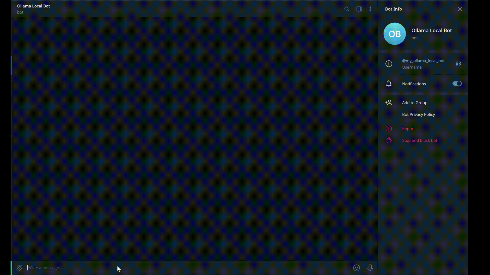

# Ollama WebUI + Telegram Bot Docker

A fully dockerised local chat system with language models (LLM), using **Ollama**, **Open WebUI**, and an **optional Telegram bot**.  
Automatic hardware detection, automatic model downloads, and simple management with bash scripts.

> **Completely local** • No cloud dependencies • Guaranteed privacy

---

## ✨ Features

- ✅ **Automatic hardware detection** – NVIDIA GPU, AMD ROCm, or CPU
- ✅ **Automatic model downloads** – Models are pulled automatically on startup
- ✅ **Web interface** – Open WebUI with chat, history, and settings
- ✅ **Telegram bot (optional)** – Chat with your local LLM directly from Telegram
- ✅ **Shared Ollama backend** – WebUI and Telegram bot use the same models
- ✅ **Data persistence** – Models and chat history survive restarts
- ✅ **Utility scripts** – `start.sh` and `clean.sh` for easy management
- ✅ **Completely private** – Everything runs locally
- ✅ **Portable** – Copy the folder to another machine and it just works

---

## 🛠️ Requirements

| Resource | Minimum | Recommended |
|---------|--------|-------------|
| **Disk space** | 25 GB | 50 GB+ |
| **RAM** | 8 GB | 16 GB+ |
| **GPU** | - | NVIDIA or AMD |
| **Software** | Docker + Docker Compose | Latest version |

**Install Docker:** [Official instructions](https://docs.docker.com/get-docker/)

---

## 🚀 Quick Start

### Initial configuration (optional)

If you wish to change ports or settings:

```bash
cp .env.example .env
# Edit .env with your custom values
nano .env
```

**Variables available in `.env`:**
```env
# Ports (default 8080 for Open WebUI, 11434 for Ollama)
OLLAMA_PORT=11434
WEBUI_PORT=8080

# Models
OLLAMA_MODELS="phi3 mistral"

# Ollama configuration
OLLAMA_KEEP_ALIVE=5m          # Keep model in memory
OLLAMA_NUM_PARALLEL=1         # Parallel requests

# Telegram bot (optional)
TELEGRAM_TOKEN=YOUR_TELEGRAM_BOT_TOKEN
TELEGRAM_BOT_MODEL=phi3
```

> ⚠️ If TELEGRAM_TOKEN is not defined, the Telegram bot will not be deployed.

### First start-up (models will download automatically)

```bash
git clone https://github.com/tu-usuario/ollama_webui.git
cd ollama_webui
chmod +x scripts/start.sh scripts/clean.sh
scripts/start.sh
```

The script will do everything automatically:
1. 🔍 Detect your hardware (GPU or CPU)
2. 🔧 Generate optimised `docker-compose.generated.yml`
3. 🐳 Start Ollama, Open WebUI, and Telegram bot (if enabled); on the ports configured in `.env`
4. 📥 Download models `OLLAMA_MODELS`
5. ✅ Display message when ready

⏱ **Estimated time:** 10-60 minutes (first time, depending on your connection)

### 🌐 Access

- **Web UI**

Open in your browser (use the port you configured in `.env`):
```
http://localhost:{WEBUI_PORT}
```

Select a model and start chatting. It's that simple!


- **Telegram**

Start a chat with your bot on Telegram and send messages immediately.



> **How to create a Telegram bot & token (2 minutes):**
> 1. Open Telegram and search for **@BotFather**
> 2. Send `/start`
> 3. Send `/newbot`
> 4. Choose a name and username for your bot
> 5. Copy the **Bot Token** provided by BotFather
> 
> Then add the token to your `.env` file:
> ```env
> TELEGRAM_TOKEN=YOUR_TELEGRAM_BOT_TOKEN
> ```
> 📖 Official Telegram docs:
> https://core.telegram.org/bots#creating-a-new-bot

---

## 📂 Project Structure

```
ollama_webui/
├── scripts/                          # Main scripts
│   ├──🚀 start.sh                    # Start everything (hardware detection + startup  + models)
│   └──🧹 clean.sh                    # Cleans containers + models + data
│
├── config/                           # ⚙️ Service configuration
│   └──🔧 ollama-init.sh              # Ollama initialisation (downloads models)
│
├── compose/                          # 🐳 Docker Compose
│   └── docker-compose.generated.yml  # Created automatically (do not upload to Git)
│
├── telegram-bot/                  # 🤖 Telegram bot service
│
├── 📁 data/                         # 💾 Persistent data (ignore in Git)
│   ├── ollama_data/                  # Downloaded models
│   └── openwebui_data/               # 💬 Chat history and configuration
│
├── 📖 README.md                      # This file
├── ⚖️  LICENSE                        # MIT Licence
├── 📁 .gitignore                     # Files ignored in Git
├── ⚙️  .env.example                   # Configuration example (upload to Git)
└── 📄 .env                           # Your local configuration (ignore in Git)
```

---

## 📚 Usage

### Main commands

```bash
# First time - download models and start everything
scripts/start.sh

# Stop containers (keeps data)
docker compose -f compose/docker-compose.generated.yml stop

# Restart (quick, without downloading models)
docker compose -f compose/docker-compose.generated.yml start

# Clean everything (deletes containers, models, data)
scripts/clean.sh
```

### View status

```bash
# Container status
docker compose -f compose/docker-compose.generated.yml ps

# Ollama logs
docker logs -f ollama

# Open WebUI logs
docker logs -f open-webui

# List downloaded models
docker exec -it ollama ollama list
```

---

## ⚙️ Configuration

### Change ports

1. Copy the example file:
```bash
   cp .env.example .env
   ```

2. Edit `.env` and change the ports as needed:
```env
OLLAMA_PORT=11434      # Change Ollama port if necessary
WEBUI_PORT=9000        # Change Open WebUI port (e.g. 9000)
```

3. Run `./start.sh` to apply changes:
```bash
   scripts/start.sh
   ```

4. Open `http://localhost:9000` (or the port you configured)

### Optimise Ollama

In `.env`, you can adjust Ollama's behaviour:

```env
# Time Ollama keeps the model loaded in memory
OLLAMA_KEEP_ALIVE=5m     # Increase if you want faster responses
                         # Decrease if you want to free up memory

# How many requests Ollama processes simultaneously  
OLLAMA_NUM_PARALLEL=1    # Increase if you have a lot of RAM/GPU
```

---

## 🔧 Customisation

### Change models to download

Edit `ollama-init.sh` and modify these lines:

```bash
echo ‘[Ollama Init] Downloading models...’
echo ‘[Ollama Init] Downloading llama3...’
ollama pull llama3 2>&1 | while IFS= read -r line; do echo ‘[llama3] $line’; done

echo ‘[Ollama Init] Downloading mistral...’
ollama pull mistral 2>&1 | while IFS= read -r line; do echo ‘[mistral] $line’; done

echo ‘[Ollama Init] Downloading phi3...’
ollama pull phi3 2>&1 | while IFS= read -r line; do echo ‘[phi3] $line’; done
```

**Other models available at [ollama.com](https://ollama.com/library):**
- `neural-chat` - Optimised chat
- `dolphin-mixtral` - Powerful model
- `openchat` - Alternative to Mistral
- `starling-lm` - Good balance
- And many more...

After changing, run `./start.sh` to download the new models.

### Telegram bot configuration

- Uses the same Ollama instance as WebUI
- Model used by the bot is defined via:
```bash
TELEGRAM_BOT_MODEL=phi3
```

You can switch models without restarting containers by downloading them first.

### Configure GPU manually

If `start.sh` does not detect your GPU correctly:

1. Edit `scripts/start.sh` and locate the hardware detection section where the `ollama` service GPU configuration is generated (`GPU_SECTION`).

2. **For NVIDIA:**
   ```yaml
   deploy:
     resources:
       reservations:
         devices:
           - driver: nvidia
             count: 1
             capabilities: [gpu]
   ```

3. **For AMD ROCm:**
   ```yaml
   deploy:
     resources:
       reservations:
         devices:
           - driver: amd
             count: 1
             capabilities: [gpu]
   ```

4. Then run:
   ```bash
   docker compose -f compose/docker-compose.generated.yml down
   ./start.sh
   ```

---

## 🎯 Available scripts

| Script | Function | Time |
|--------|---------|--------|
| `./start.sh` | Detects hardware, generates Compose, starts everything and downloads models | 20-60 min (1st time) |
| `./clean.sh` | Deletes containers, models and data. Restores initial state | 1-2 min |

---

## ⚡ Performance

### Speed by hardware

| Hardware | Approximate speed |
|----------|---------------------|
| **Modern CPU** | 1-5 seconds/response |
| **NVIDIA GPU** | 100-500ms/response |
| **AMD GPU** | 100-500ms/response |

### Optimisations

- **Increase dedicated RAM:** Edit Docker Desktop settings
- **Close other applications:** Free up memory
- **Use smaller models:** Phi3 is faster than Llama3

---

## ⚠️ Important considerations

### Disk space

Each model occupies:
- **llama3** → 4.7 GB
- **mistral** → 4.4 GB
- **phi3** → 2.2 GB
- **Default total** → 11 GB

**Keep at least 25 GB free** to avoid filling up the disk.

### Data persistence

- `ollama_data/` → Downloaded models
- `openwebui_data/` → Chat history and settings
- **Both are ignored in Git** (see `.gitignore`)
- **Do not delete them** if you want to keep your data

### Migration to another machine

```bash
# Copy everything including data
cp -r ollama_webui /path/destination/

# On the new machine
cd ollama_webui
scripts/start.sh  # Will continue with already downloaded models
```

### First run

- Downloading models **takes quite a long time** (20-60 min)
- The script will show progress in real time
- **Do not close the script** until you see ‘All done ✅’
- You can leave it running while you do other things

---

## 🐛 Troubleshooting

### ‘docker: command not found’
→ Install Docker from https://docs.docker.com/get-docker/

### The script is stuck waiting
→ This is normal the first time. Let it run. View logs with `docker logs -f ollama`

### Open WebUI does not display models
→ Wait for the download to finish. See `docker exec -it ollama ollama list`

### Low disk space
→ Run `./clean.sh` to clean up and start again

---

## 🤝 Contributions

Contributions are welcome. For major changes:

1. Fork the project
2. Create a branch (`git checkout -b feature/improvement`)
3. Commit changes (`git commit -m “Add improvement”`)
4. Push to the branch (`git push origin feature/improvement`)
5. Open a Pull Request

---

## 📝 Licence

This project is licensed under **MIT**. See [LICENCE](LICENCE) for full details.

---
